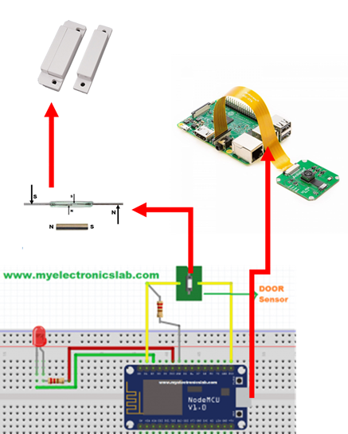
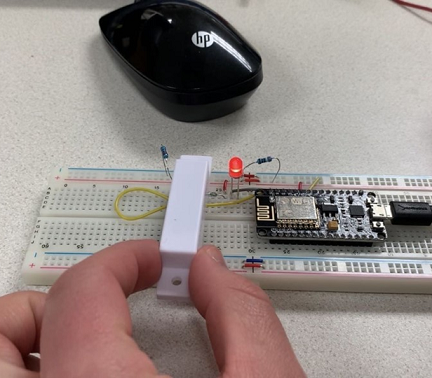
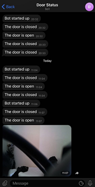
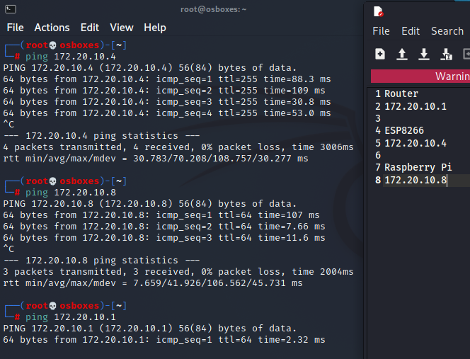
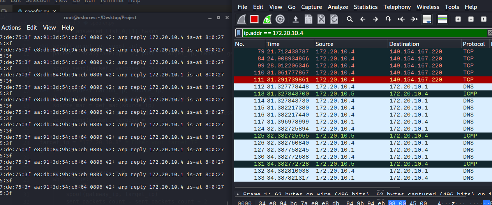

# Project Title

CIS 401 Advanced Network Security Project
Door Security System

## Description

This project is a simple door security system that uses a Raspberry Pi 3B+, Raspberry Pi Camera, NodeMCU, and reed switch to detect magnetic open/close state and send an email notification when state change is detected.

## Getting Started

### Wiring Simple Diagram


### Installing

* Download repository from GitHub.
* ex. git clone
* Install dependencies.
* ex. pip install -r requirements.txt

* Download Kali Linux Machine
* Change COM port to match your NodeMCU serial port.
* Change door_statusv3.ino to match Wifi SSID and password.
* Optional: Add Raspberry Pi to Wireguard VPN:
* Information can be found here: https://www.sigmdel.ca/michel/ha/wireguard/wireguard_02_en.html#linux_client 
* Turn on Wireguard VPN.
```
sudo wg-quick up wg0
```

### Executing program

* How to run the program
* Step-by-step bullets

* Plug in NodeMCU to Raspberry Pi with USB cable.
* Place telegrambot.py on the raspberry pi
```
python3 telegrambot.py
```
* Test reed switch by using magnetic switch.

## Example Images and Arp Poisoning Attack






*Note that since both NodeMCU and Raspberry Pi have IP addresses to act as a simple multi-factor communication system, the arpspoof attack requires two targets.
```
arpspoof -i eth0 -t [victim ip] -r [router ip]
```

## Authors

Contributors names and contact info

Samuel Estes
Adam Waite
Graham Ohleger

## Acknowledgments

Dr. Azab